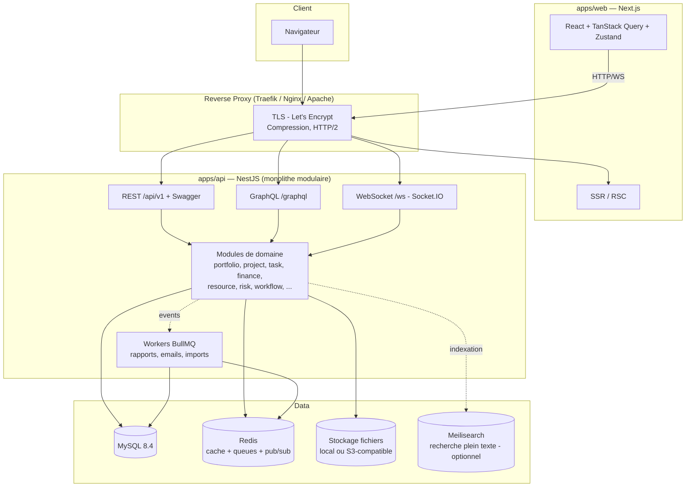

# 1. Architecture complète

## 1.1 Vue d'ensemble

**Choix structurant : monolithe modulaire** (pas de microservices au départ).

Justification : une équipe réduite, un domaine fortement couplé (un projet touche finances, ressources, risques, planning) et un produit auto-hébergeable par des PME. Les microservices multiplieraient les coûts d'exploitation sans bénéfice. Le backend NestJS est découpé en **modules de domaine étanches** (bounded contexts DDD) communiquant par événements internes — ce qui permet une extraction ultérieure en services si la charge l'exige.



## 1.2 Frontend — `apps/web`

- **Next.js (App Router)** : SSR pour la première peinture et le SEO des pages publiques (login, docs), puis navigation client. Export **standalone** pour l'image Docker.
- **TypeScript strict** partout ; types API partagés via `packages/types` (générés du schéma OpenAPI/Prisma — jamais écrits à la main deux fois).
- **TailwindCSS + shadcn/ui** : design system dans `packages/ui` (tokens macOS-like : rayons 10–14px, glassmorphism `backdrop-blur`, palette light/dark).
- **TanStack Query** : tout état serveur (cache, invalidation, optimistic updates, offline retry). **Zustand** : uniquement l'état UI local (sidebar, sélections, préférences de vue).
- **i18n** : `next-intl`, fichiers `messages/{fr,en,es,de}.json`, aucune chaîne en dur (règle ESLint dédiée).
- **Temps réel** : client Socket.IO ; les événements invalident les caches TanStack Query ciblés.
- **Gantt** : module maison `packages/gantt` (SVG virtualisé + canvas pour les grilles) — les libs open source existantes ne couvrent pas chemin critique + baseline + charge. C'est un investissement assumé, différenciant du produit.
- **Graphiques** : Recharts (pie/bar/line/heatmap) encapsulés dans les widgets du dashboard.
- **Accessibilité** : composants Radix (base de shadcn), navigation clavier, WCAG 2.1 AA visé.

Arborescence :

```
apps/web/src/
├── app/                      # App Router
│   ├── (auth)/login, forgot-password, mfa
│   ├── (app)/                # layout applicatif (sidebar Finder-like)
│   │   ├── dashboard/        ├── portfolios/       ├── programs/
│   │   ├── projects/[id]/    #   overview, gantt, board, backlog, tasks,
│   │   │                     #   finance, risks, issues, documents, settings
│   │   ├── resources/        ├── demands/          ├── quotes/
│   │   ├── reports/          ├── roadmap/          ├── search/
│   │   └── admin/            #   users, roles, groups, sso, workflows, audit
│   └── api/                  # routes BFF minimales (upload proxy, health)
├── features/<domaine>/       # composants + hooks + queries par domaine
├── lib/                      # api-client, auth, socket, utils
└── messages/                 # i18n
```

## 1.3 Backend — `apps/api`

**Clean Architecture par module de domaine.** Chaque module suit :

```
src/modules/<domaine>/
├── domain/            # entités, value objects, événements, interfaces repository
├── application/       # use cases (services), DTO (class-validator), mappers
├── infrastructure/    # PrismaRepository, adaptateurs externes
└── presentation/      # controllers REST, resolvers GraphQL, gateways WS
```

Règles :
- `domain` ne dépend de rien ; `application` dépend de `domain` ; `infrastructure` et `presentation` dépendent des deux. Vérifié par `eslint-plugin-boundaries`.
- Communication inter-modules **uniquement** par : (a) interfaces publiques exposées dans `index.ts` du module, (b) événements de domaine (`EventEmitter2` en interne, BullMQ pour l'asynchrone). Jamais d'import direct des repositories d'un autre module.
- **Repository Pattern** : les use cases parlent à des interfaces (`ProjectRepository`), Prisma reste confiné dans `infrastructure`.
- **DTO validés** (`class-validator` + `class-transformer`), whitelist stricte (`forbidNonWhitelisted`).
- **CQRS léger** là où c'est utile (reporting, dashboards) : requêtes de lecture optimisées SQL sans passer par le modèle riche.

Modules transverses (`src/core/`) : auth, rbac (CASL), tenancy, audit (interceptor global), notifications, search, files, workflow-engine, custom-fields, i18n, health.

### API

- **REST `/api/v1`** : ressource par module, pagination cursor + offset, filtres normalisés (`?filter[status]=active&sort=-createdAt`), versionnée par URI. Swagger auto-généré (`@nestjs/swagger`) sur `/api/docs`.
- **GraphQL `/graphql`** : schéma code-first, réservé aux lectures composées (dashboards, arbres portfolio→programme→projet), mutations critiques exposées aussi. Depth/complexity limits.
- **WebSocket `/ws`** : rooms par entité (`project:{id}`, `board:{id}`), événements typés (`task.updated`, `comment.created`, `notification.new`). Auth par JWT au handshake.

### Authentification et autorisation

- **JWT access (15 min) + refresh token rotatif** (stocké haché en BDD, détection de réutilisation → révocation de la famille de tokens). Cookies `httpOnly` + `SameSite=Lax` pour le web, header Bearer pour l'API.
- **2FA TOTP** (otplib) + codes de récupération.
- **SSO** : Passport strategies — OIDC (`openid-client`), OAuth2 générique, SAML 2.0 (`@node-saml/passport-saml`), LDAP/Active Directory (`ldapts`) avec provisioning JIT et mapping de groupes → rôles.
- **RBAC** : rôles système (Administrateur, Manager, Chef de projet, PMO, Finance, Employé, Observateur, Invité) + rôles personnalisés. Permissions fines `action:ressource` évaluées par **CASL** (conditions par attributs : propriétaire, membre du projet, même organisation). Guards NestJS + directive GraphQL + filtrage Prisma automatique.
- **Multi-tenant** : colonne `organization_id` sur toutes les tables métier, middleware Prisma (`$extends`) injectant le filtre — même approche éprouvée que le scope global, mais au niveau ORM.

### Sécurité (OWASP)

helmet, CORS strict, rate limiting (`@nestjs/throttler` + Redis, budgets par IP et par utilisateur), protection CSRF (double-submit cookie sur les mutations cookie-based), validation/échappement systématique (XSS), requêtes paramétrées (Prisma), verrouillage de compte progressif, politique de mots de passe (zxcvbn), en-têtes CSP, audit trail complet (qui/quand/avant/après/IP — interceptor global + table `audit_logs`), logs structurés (pino) avec redaction des secrets.

## 1.4 Base de données

- **MySQL 8.4 LTS**, charset `utf8mb4`, moteur InnoDB.
- **Prisma** : schéma unique `packages/db/prisma/schema.prisma`, migrations versionnées (`prisma migrate`), seed idempotent (rôles, permissions, templates, données de démo optionnelles).
- Conventions : `snake_case` en BDD (via `@map`), UUID v7 en clés primaires (triables), `created_at`/`updated_at`/`deleted_at` (soft delete → corbeille), index composites sur `(organization_id, <fk>)`.
- **Recherche plein texte** : index FULLTEXT MySQL pour le MVP ; **Meilisearch optionnel** (activé par variable d'env) pour la recherche globale Enterprise (typo-tolérance, facettes).
- Voir [02-database-erd.md](02-database-erd.md).

## 1.5 Jobs asynchrones et planification

**BullMQ** (Redis) — files : `mail`, `reports` (génération PDF/Excel), `imports` (Excel/CSV/MS Project), `notifications`, `search-index`, `workflow` (actions différées, escalades), `scheduler` (rapports programmés, digests). Workers dans le même process en petit déploiement, extractibles en conteneur `worker` dédié (variable `APP_ROLE=worker`).

PDF : Playwright headless (rendu HTML → PDF, mêmes templates que l'UI). Excel : `exceljs`. Emails : `nodemailer` + templates MJML, SMTP configurable.

## 1.6 Infrastructure et déploiement

### Docker — 3 modes

```
infra/docker/
├── docker-compose.yml            # Mode 1 : front + api + worker + mysql + redis (+ traefik)
├── docker-compose.external-db.yml# Mode 2 : front + api + worker + redis, MySQL externe
├── docker-compose.api-only.yml   # Mode 3 : api + worker seuls (front hébergé ailleurs, MySQL externe)
├── Dockerfile.web                # build multi-stage → next standalone, non-root, distroless-like
├── Dockerfile.api                # build multi-stage → node:22-alpine, non-root, healthcheck
└── .env.example                  # toutes les variables documentées
```

- Images multi-stage (< 200 Mo), user non-root, `HEALTHCHECK`, tags semver + `latest`.
- Entrypoint API : attente MySQL → `prisma migrate deploy` → démarrage. Zéro étape manuelle.
- Configurations fournies : `infra/nginx/openppm.conf` et `infra/apache/openppm.conf` (reverse proxy + WebSocket upgrade + SSL), Traefik en labels dans le compose (Let's Encrypt automatique).

### Kubernetes

`infra/helm/openppm/` : chart Helm — Deployments (web, api, worker), HPA, Ingress (nginx ou Traefik), Secrets/ConfigMaps, PVC pour les fichiers (ou S3), sous-charts optionnels bitnami MySQL/Redis, `values-production.yaml` commenté.

### Scripts d'exploitation

`scripts/` : `install.sh` (setup interactif), `backup.sh` / `restore.sh` (mysqldump + fichiers, rotation), `migrate.sh`, `upgrade.sh`.

## 1.7 CI/CD — GitHub Actions

| Workflow | Déclencheur | Contenu |
|---|---|---|
| `ci.yml` | PR, push main | lint + typecheck + tests unitaires → tests d'intégration (MySQL/Redis en services) → build → E2E Playwright (matrice Chromium/Firefox) — le tout parallélisé via Turborepo cache |
| `security.yml` | PR + hebdo | audit dépendances, CodeQL, scan images (Trivy), gitleaks |
| `release.yml` | tag `v*` | build images multi-arch → GHCR, génération changelog (conventional commits), publication Helm chart, GitHub Release |
| `docs.yml` | push main | build et déploiement du site de documentation |

Qualité bloquante en PR : ESLint, Prettier, `tsc --noEmit`, couverture minimale (voir plan de tests), commits conventionnels (commitlint), migrations Prisma vérifiées (`migrate diff` propre).

## 1.8 Performance

- Pagination systématique (curseur pour les listes infinies, offset pour les tables).
- Cache Redis : permissions résolues, agrégats de dashboards (TTL courts + invalidation par événements), réponses GraphQL coûteuses.
- Lazy loading front (code-splitting par route, virtualisation des longues listes/Gantt via TanStack Virtual).
- Compression Brotli/gzip au proxy, assets immutables fingerprintés, images `next/image`.
- SQL : index revus à chaque migration, `EXPLAIN` sur les requêtes de reporting, agrégats pré-calculés (santé projet, charge) rafraîchis par jobs.
- Budgets : P95 API < 300 ms, first load < 2 s, interactions Gantt/Kanban < 16 ms/frame.

## 1.9 Observabilité

`/health` (liveness/readiness, état MySQL/Redis), métriques Prometheus (`/metrics`), logs JSON pino corrélés (request-id), OpenTelemetry optionnel (traces), Sentry optionnel (variable d'env).
