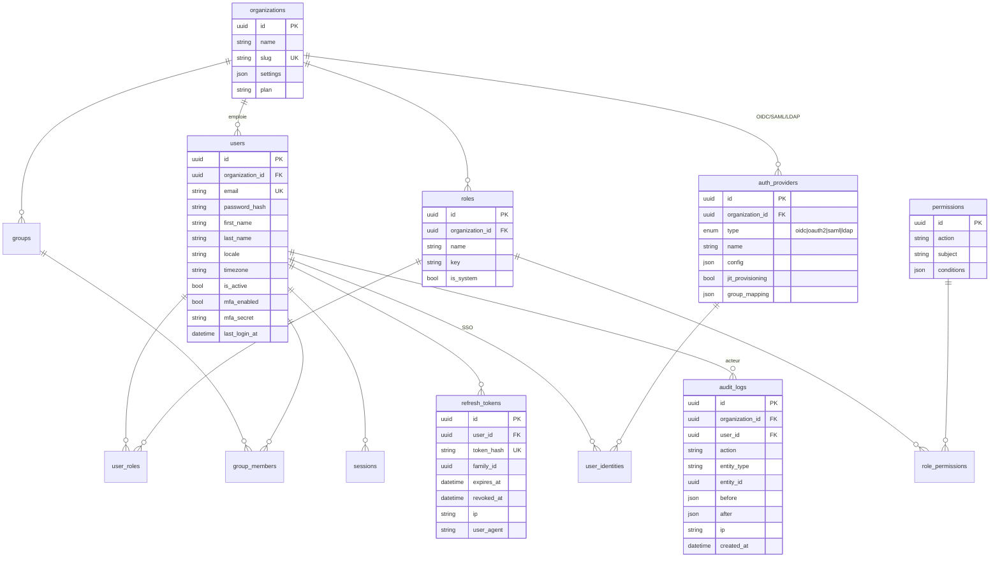
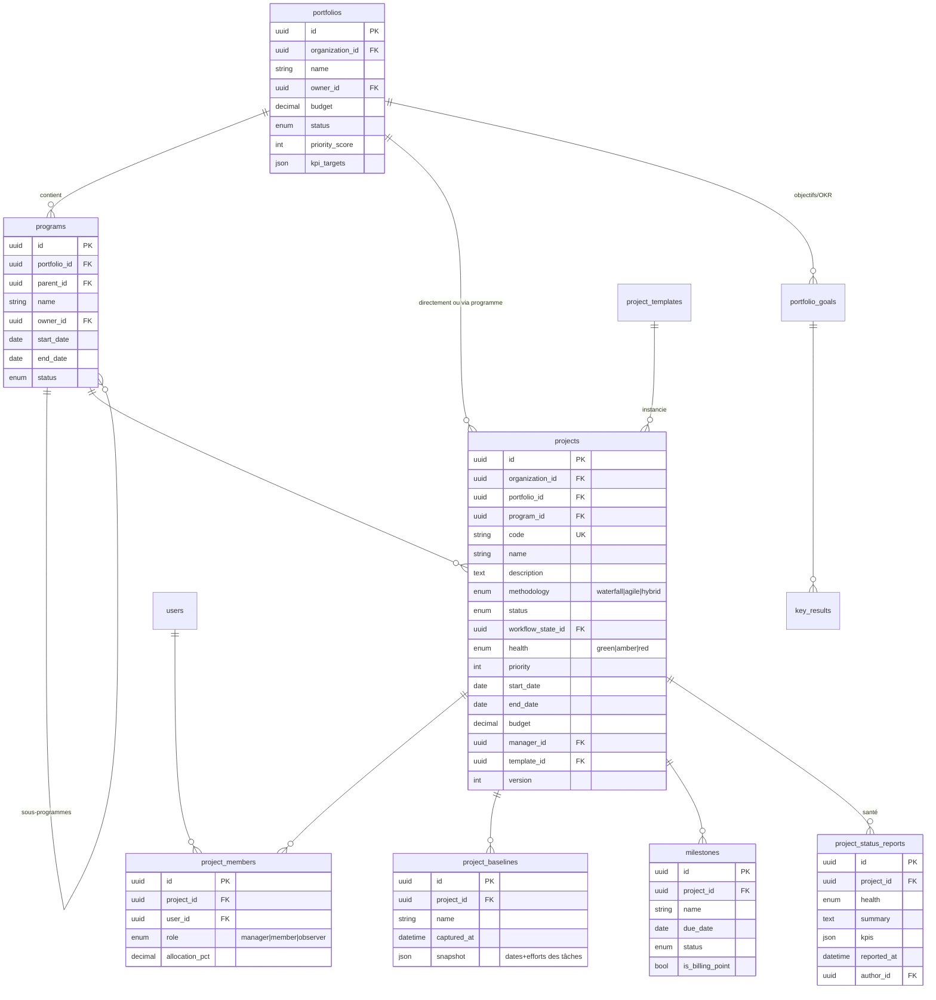
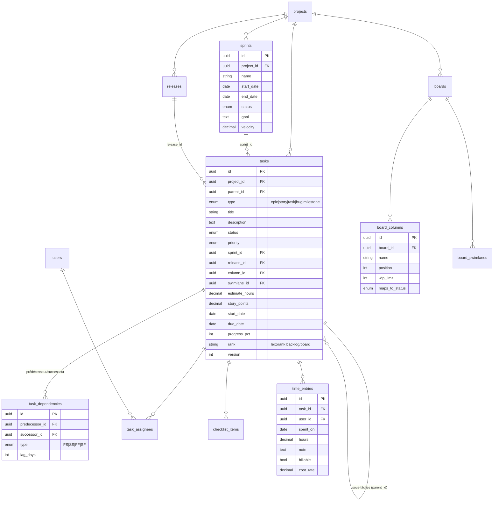
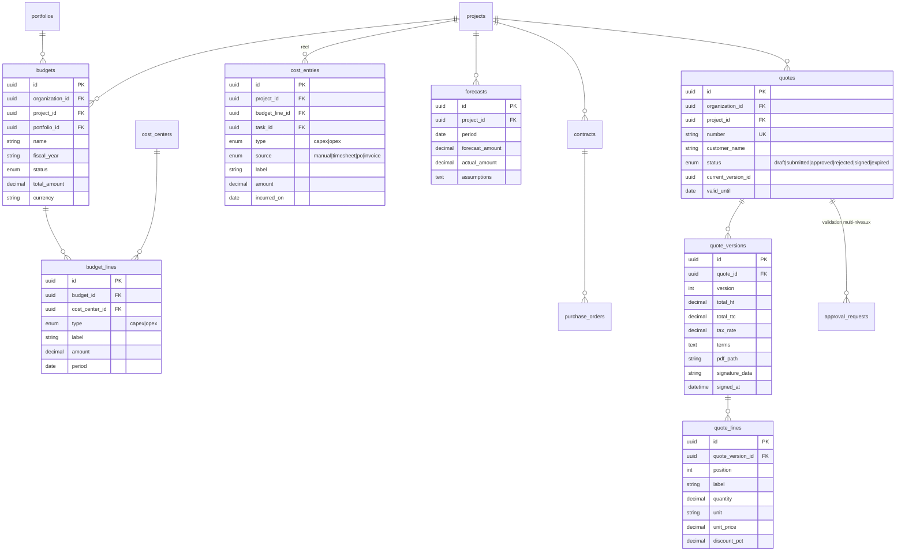
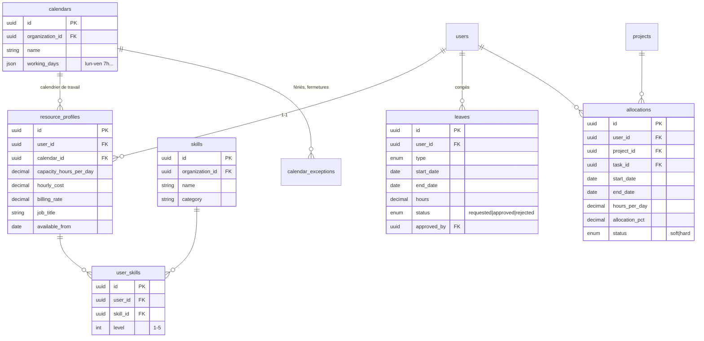
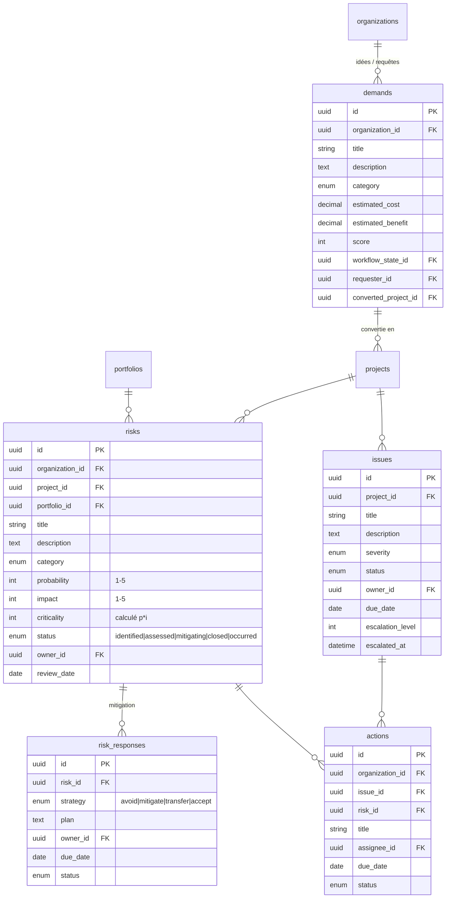
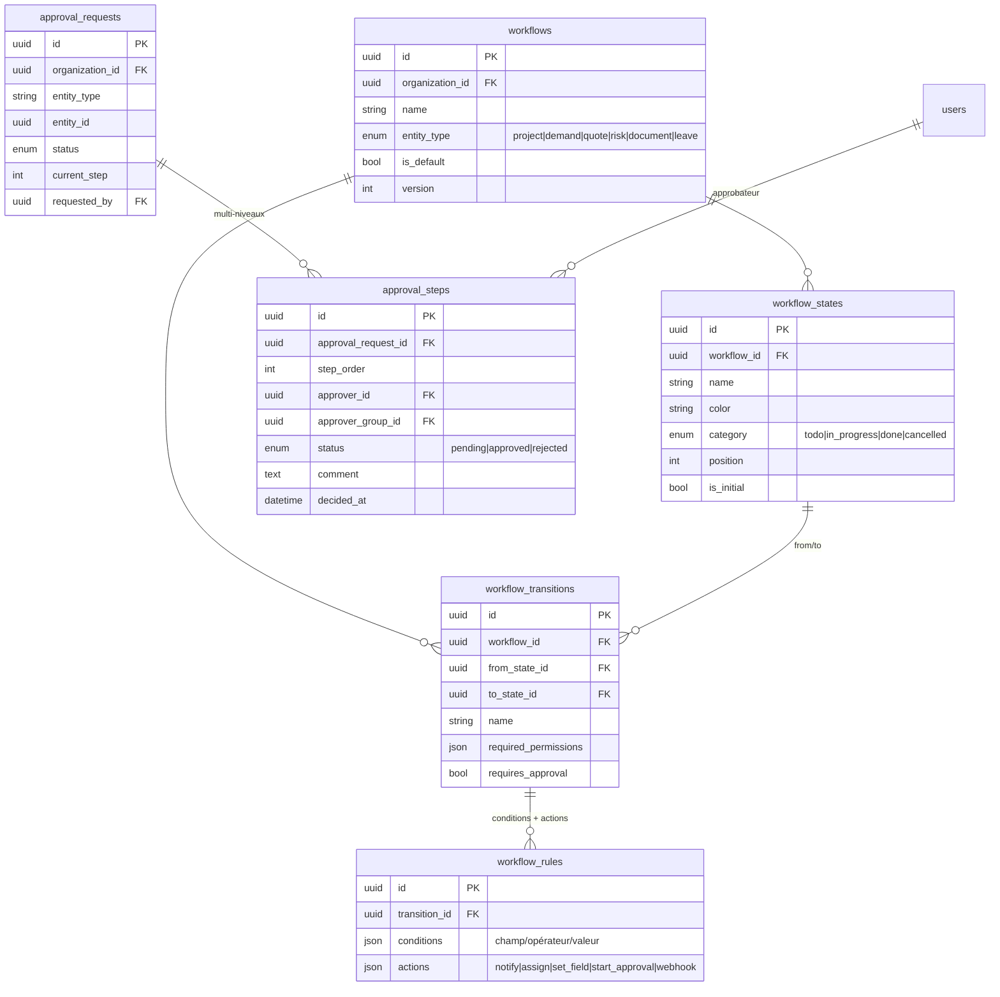
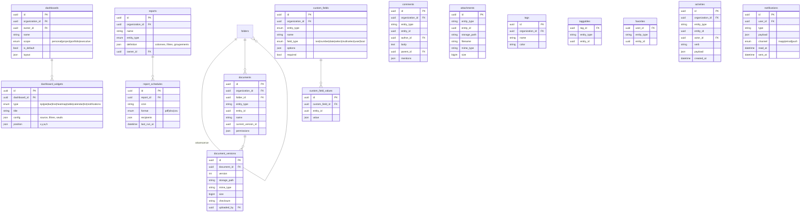

# 2. Schéma de base de données (ERD)

Conventions : UUID v7 en PK, `organization_id` sur toute table métier (multi-tenant), `created_at` / `updated_at` / `deleted_at` (soft delete), `snake_case`. Les diagrammes ci-dessous montrent les colonnes structurantes, pas l'exhaustivité (le schéma Prisma fait foi : `packages/db/prisma/schema.prisma`).

## 2.1 Identité, accès, organisation

## 2.2 Portfolio, programmes, projets

## 2.3 Tâches, planning, Agile

Une seule table `tasks` porte tous les types d'éléments de travail (epic, story, task, bug, subtask via `parent_id`) — évite les jointures polymorphes et simplifie Gantt/board/backlog.

## 2.4 Finances et devis

## 2.5 Ressources et capacité

## 2.6 Risques, problèmes, demandes

## 2.7 Workflow, approbations, automatisation

## 2.8 Transverse : documents, commentaires, tags, dashboards, notifications

## 2.9 Inventaire des tables (≈ 60)

| Domaine | Tables |
|---|---|
| Identité / accès | organizations, users, roles, permissions, role_permissions, user_roles, groups, group_members, sessions, refresh_tokens, password_resets, auth_providers, user_identities, audit_logs |
| Portfolio / projets | portfolios, portfolio_goals, key_results, programs, projects, project_templates, project_members, project_baselines, project_status_reports, milestones |
| Travail / Agile | tasks, task_dependencies, task_assignees, checklist_items, time_entries, sprints, releases, boards, board_columns, board_swimlanes |
| Finances | budgets, budget_lines, cost_centers, cost_entries, forecasts, contracts, purchase_orders, quotes, quote_versions, quote_lines |
| Ressources | resource_profiles, skills, user_skills, calendars, calendar_exceptions, leaves, allocations |
| Risques / demandes | risks, risk_responses, issues, actions, demands |
| Workflow | workflows, workflow_states, workflow_transitions, workflow_rules, approval_requests, approval_steps |
| Transverse | folders, documents, document_versions, comments, attachments, tags, taggables, favorites, activities, notifications, dashboards, dashboard_widgets, reports, report_schedules, custom_fields, custom_field_values |

Points de conception :
- **Chemin critique / Gantt** : calculé à la volée côté API (CPM sur `tasks` + `task_dependencies`), les baselines figent un snapshot JSON — pas de duplication de lignes.
- **Charge / capacité** : `allocations` (prévisionnel) vs `time_entries` (réel) vs `resource_profiles.capacity` — les trois axes du reporting de charge.
- **Santé projet** : dérivée (retard planning, dérive budget, risques critiques ouverts) et matérialisée dans `projects.health` par job, historisée dans `project_status_reports`.
- **Corbeille / archivage** : soft delete (`deleted_at`) + `archived_at` sur portfolios/programmes/projets ; purge planifiée configurable.
