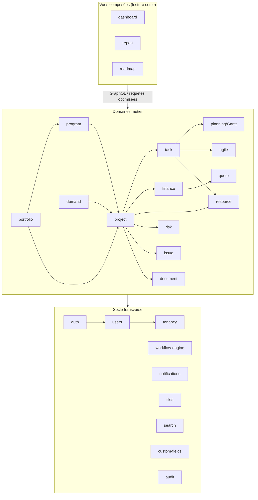

# 3. Modules et relations

## 3.1 Liste exhaustive

### Socle transverse (`core/`)

| Module | Responsabilité | Dépend de |
|---|---|---|
| `auth` | Login/logout, mot de passe oublié, 2FA TOTP, sessions, JWT + refresh rotatif, SSO (OIDC, OAuth2, SAML, LDAP/AD) | users |
| `users` | Comptes, profils, rôles, permissions (RBAC/CASL), groupes | — |
| `tenancy` | Organisations, isolation multi-tenant, paramètres | — |
| `audit` | Journal complet (qui, quand, avant, après, IP) — interceptor global | auth |
| `workflow-engine` | États, transitions, conditions, actions automatiques, approbations multi-niveaux, escalades | notifications, users |
| `notifications` | In-app, email, push (Web Push), WebSocket temps réel, préférences par canal | users |
| `files` | Stockage (local/S3), upload, antivirus optionnel, prévisualisation | — |
| `search` | Recherche globale indexée (FULLTEXT → Meilisearch), filtres, facettes | tous les domaines (événements) |
| `custom-fields` | Champs personnalisés typés sur toute entité | — |
| `comments` | Commentaires threadés + mentions, sur toute entité | notifications |
| `tags-favorites` | Tags, favoris, éléments récents | — |
| `activity` | Flux d'activité par entité et global | — |
| `i18n` | Traductions FR/EN/ES/DE, formats dates/nombres/devises | — |
| `import-export` | Import Excel/CSV/MS Project (.mpp/.xml)/OpenProject ; exports | projects, tasks |
| `trash` | Corbeille, restauration, archivage, purge planifiée | — |

### Domaines métier (`modules/`)

| Module | Responsabilité | Dépend de |
|---|---|---|
| `portfolio` | Portefeuilles, objectifs/OKR, priorisation (scoring), budgets agrégés, capacité, roadmap portfolio, KPIs | project, program, finance (lecture) |
| `program` | Programmes, sous-programmes, planning consolidé, KPIs | project |
| `project` | Projets, templates, catégories, cycle de vie (workflow), versions, membres, baselines, santé, historique | workflow-engine, users |
| `task` | Tâches, sous-tâches, checklists, dépendances, priorités, estimations, temps passé (timesheet) | project, resource |
| `planning` | Gantt (CPM, chemin critique, baseline, charge), jalons, calendrier projet, exports PDF/PNG/Excel | task |
| `agile` | Boards Kanban (colonnes, swimlanes, WIP), Scrum (sprints, epics, stories, backlog ranké, burndown, vélocité, releases) | task |
| `finance` | Budgets CAPEX/OPEX, coûts réels, prévisions/forecast, ROI, centres de coûts, contrats, commandes, facturation | project, portfolio |
| `quote` | Devis : versions, lignes, workflow de validation multi-niveaux, signature, PDF, historique | workflow-engine, files, finance |
| `resource` | Profils ressources, capacité, disponibilité, calendriers, congés, compétences, affectations, prévisions de charge | users, project |
| `risk` | Registre des risques (probabilité × impact = criticité), plans de mitigation, matrice, dashboard risques | project, portfolio, workflow-engine |
| `issue` | Incidents/problèmes, actions correctives, suivi, escalade automatique | project, workflow-engine |
| `demand` | Gestion de la demande : idées/requêtes, scoring coût/bénéfice, pipeline de qualification, conversion en projet | workflow-engine, portfolio |
| `document` | GED : arborescence, versionning, prévisualisation, permissions fines | files, users |
| `dashboard` | Dashboards personnalisables (widgets KPI, pie, bar, line, heatmap, table, calendrier, liste, notifications), vue exécutive | tous (lecture GraphQL) |
| `report` | Rapports dynamiques (définition colonnes/filtres/groupements), exports PDF/Excel/CSV, programmation et envoi automatique | tous (lecture), jobs |
| `roadmap` | Timeline globale multi-niveaux (portfolio → programme → projet → jalon), objectifs, scénarios | portfolio, program, project |

## 3.2 Graphe de dépendances

Règles de couplage :
- Une flèche = dépendance autorisée via l'API publique du module (`index.ts`) uniquement.
- Les modules de **lecture composée** (dashboard, report, roadmap) ne modifient jamais les données ; ils lisent via des query services dédiés (CQRS léger).
- Toute réaction croisée passe par **événements de domaine** : ex. `time_entry.created` → finance (coût réel) + resource (charge consommée) ; `task.updated` → planning (recalcul CPM) + search (réindexation) ; `quote.approved` → finance (engagement budgétaire).

## 3.3 Activation à la carte

Chaque organisation active ses modules (table `organizations.settings.enabled_modules`). Le socle (auth, users, project, task) est toujours actif ; portfolio, finance, quote, risk, demand, agile, planning avancé sont activables — la navigation, les permissions et les API s'ajustent dynamiquement.
