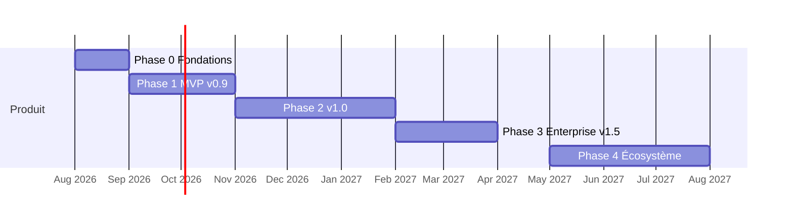

# 6. Roadmap de développement

Principe : chaque phase livre des fonctionnalités **terminées, testées, documentées** — jamais de mock, jamais de module « à moitié ». Une fonctionnalité non finie ne passe pas la phase.

## Phase 0 — Fondations (≈ 4 semaines)

Le socle technique sur lequel tout repose. Aucune fonctionnalité métier.

- Monorepo (pnpm + Turborepo), packages `config`, `types`, `ui` (design system macOS-like : tokens, thème dark/light, composants de base).
- `packages/db` : schéma Prisma initial (identité/accès), migrations, seed.
- API NestJS : squelette Clean Architecture, Swagger, GraphQL, WebSocket, health, logs pino, rate limiting, helmet, i18n backend.
- **Auth complète** : login/logout, refresh rotatif, mot de passe oublié (emails réels SMTP), 2FA TOTP, sessions, verrouillage progressif.
- **RBAC** : 8 rôles système, permissions CASL, groupes, guards.
- **Multi-tenant** : organisations, isolation Prisma, onboarding première organisation.
- **Audit trail** global (interceptor + UI admin minimale plus tard).
- Front : shell applicatif (sidebar Finder, topbar, ⌘K, dark mode), pages auth, i18n FR/EN (ES/DE ajoutées en continu).
- Docker mode 1 fonctionnel, CI complète (lint, tests, build, E2E smoke).

**Critère de sortie** : un utilisateur s'inscrit, crée son organisation, invite des collègues avec rôles, se connecte en 2FA — le tout via Docker Compose et couvert par les tests.

## Phase 1 — MVP v0.x (≈ 10 semaines) : gérer des projets au quotidien

| Lot | Contenu |
|---|---|
| M1 Projets | CRUD projets, catégories, états (workflow simple figé), membres, templates de base, historique/activité, favoris, corbeille |
| M2 Tâches | Tâches/sous-tâches, checklists, priorités, dates, assignations, dépendances (données), commentaires + mentions + notifications in-app/email, pièces jointes, temps passé (timesheet simple) |
| M3 Kanban | Boards, colonnes, WIP, swimlanes, drag & drop, filtres |
| M4 Gantt v1 | Timeline jours/semaines/mois, drag & drop, dépendances visuelles, jalons, export PNG/PDF |
| M5 Dashboard v1 | Dashboard projet + « mes tâches », widgets fixes (KPI, listes, bar) |
| M6 Recherche & docs | Recherche globale (FULLTEXT), GED v1 (upload, dossiers, versions), import/export Excel & CSV |

**Critère de sortie (v0.9 « MVP »)** : une PME remplace Trello + un Gantt Excel : projets, tâches, board, Gantt, temps passé, documents, notifications — multi-utilisateur, multilingue FR/EN, déployé en un `docker compose up`.

## Phase 2 — v1.0 (≈ 12 semaines) : le PPM complet

| Lot | Contenu |
|---|---|
| P1 Portfolio & programmes | Portefeuilles, programmes/sous-programmes, objectifs & OKR, scoring/priorisation, roadmap portfolio |
| P2 Finances | Budgets CAPEX/OPEX, centres de coûts, coûts réels (liés aux timesheets), forecast, ROI, contrats, commandes |
| P3 Devis | Module quotations complet : versions, PDF, signature, validation multi-niveaux |
| P4 Ressources | Capacité, calendriers, congés, compétences, affectations, plan de charge, prévisions |
| P5 Risques & problèmes | Registre des risques (P×I), mitigation, matrice, dashboard ; issues, actions, escalade |
| P6 Workflow engine | Éditeur de workflows (états, transitions, conditions, actions), approbations multi-niveaux, application aux projets/devis/demandes/congés |
| P7 Agile complet | Sprints, epics/stories, backlog ranké, burndown, vélocité, releases |
| P8 Gantt v2 | Chemin critique, baselines, histogramme de charge, zoom année, export Excel |
| P9 Dashboards & reporting | Widgets configurables drag & drop (pie, line, heatmap, calendrier…), vue exécutive, rapports dynamiques PDF/Excel/CSV, programmation et envoi automatique |
| P10 Demandes | Demand management : pipeline, scoring, conversion en projet |

Transverse phase 2 : ES + DE finalisés, notifications push, GraphQL enrichi, Helm chart, guides utilisateur/admin.

**Critère de sortie (v1.0)** : couverture fonctionnelle comparable à ServiceNow SPM pour une ETI ; démo publique ; documentation complète ; migration depuis v0.x automatique.

## Phase 3 — Enterprise (≈ 10 semaines)

- **SSO** : OIDC, OAuth2, SAML, LDAP/AD, provisioning JIT, mapping groupes→rôles.
- **Champs personnalisés** sur toutes les entités + workflows conditionnels avancés (webhooks, escalades temporisées).
- **Imports** MS Project (.mpp/.xml) et OpenProject ; Meilisearch pour la recherche.
- **Scalabilité** : workers dédiés, HPA K8s, cache agrégats, tests de charge k6 validés (500 utilisateurs simultanés).
- **Audit UI** complète (avant/après, IP, export), conformité RGPD (export/purge des données personnelles).
- Corbeille/archivage avancés, API publique stabilisée (versioning, tokens d'API, webhooks sortants).
- Durcissement sécurité : pentest, CSP stricte, scan continu.

**Critère de sortie (v1.5 « Enterprise »)** : déployable chez une grande entreprise avec SSO SAML/AD, 10 000 utilisateurs provisionnés, audité, supporté en HA.

## Phase 4 — Écosystème (continu)

SDK plugins, marketplace, application mobile (PWA d'abord), IA (résumés de statut, détection de dérive), connecteurs (Jira, GitLab, Slack/Teams), BI (export entrepôt de données).

## Jalons récapitulatifs

